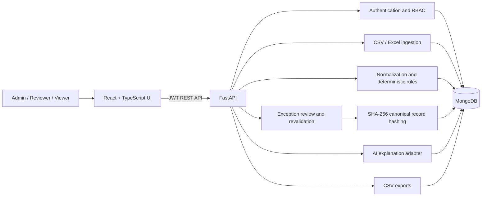
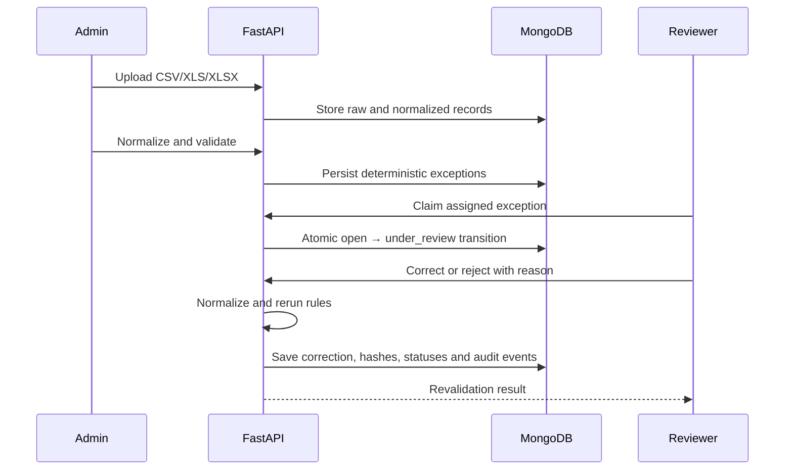
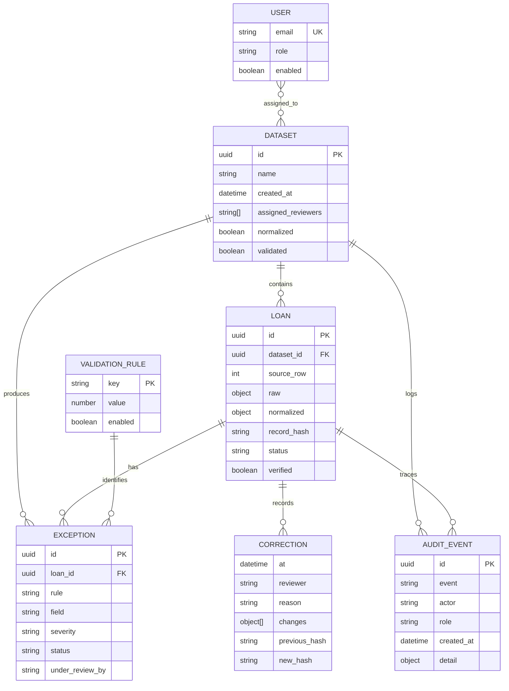

# Architecture and Data Model

## System architecture

The backend is the authorization boundary. Hiding a control in React is never
treated as a security control. Every mutating endpoint verifies the JWT role,
and reviewer operations additionally verify dataset assignment and ownership of
the claimed exception.

## Verification sequence

## Logical data model

Corrections are embedded in their loan record so the previous and new hashes
remain adjacent to the field-level change. Audit events remain separate,
append-only operational evidence.

## Trust boundaries

- AI output is advisory text only and cannot mutate or verify a record.
- Deterministic rules determine whether an exception still fails.
- Only an assigned reviewer who atomically claimed an exception may decide it.
- A record is marked `Verified` only when no `open` or `under_review`
  exceptions remain.
- SHA-256 hashes detect changes to canonical normalized record content; they are
  not presented as blockchain or digital signatures.

